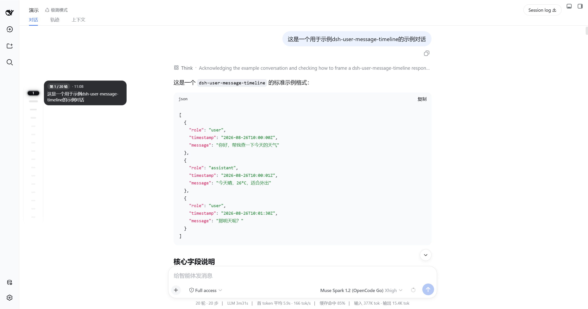
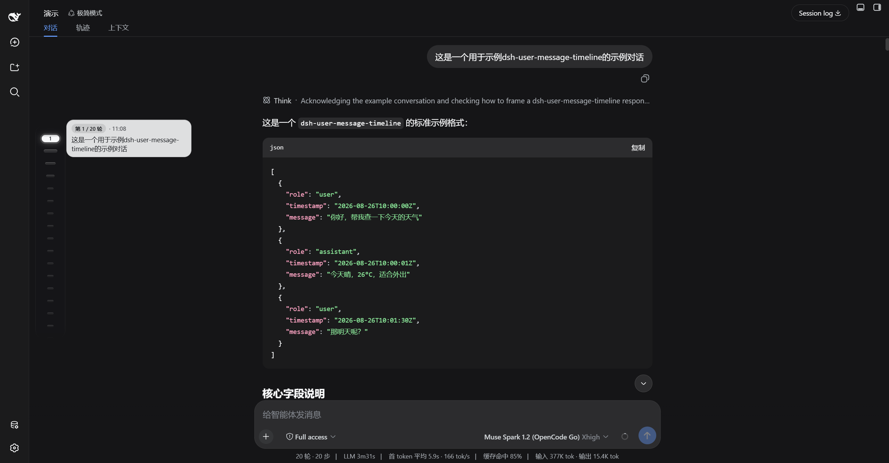
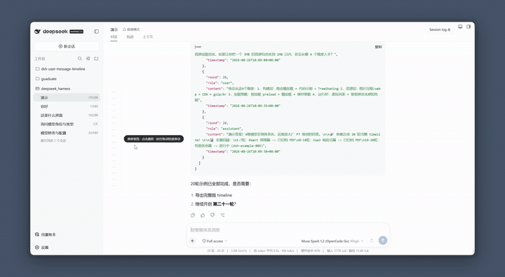
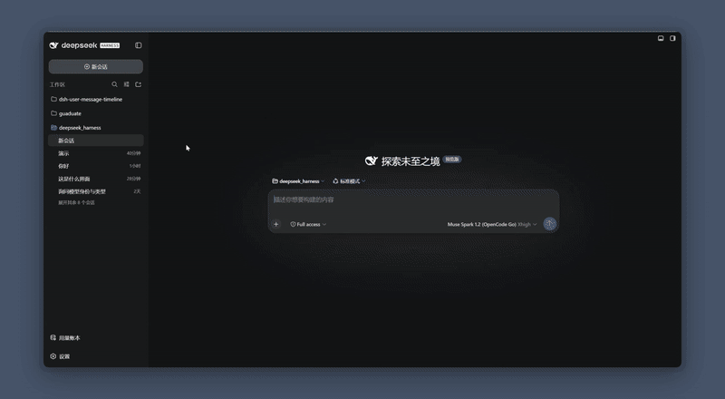
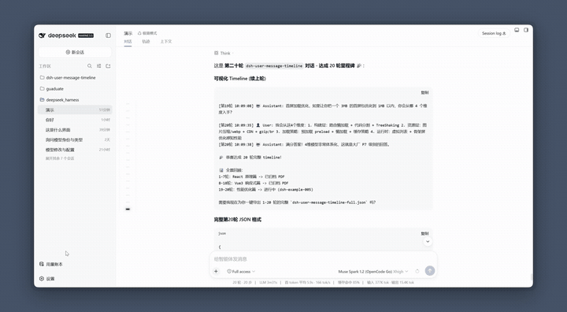

# dsh-user-message-timeline

<p align="center"><strong>对话列悬浮药丸导轨，一套开箱即用的完整时间线</strong></p>

<p align="center">
  <a href="https://www.npmjs.com/package/dsh-user-message-timeline"></a>
  <a href="https://www.npmjs.com/package/dsh-user-message-timeline"></a>
  
  <a href="https://github.com/huang-chunc/dsh-user-message-timeline/stargazers"></a>
  <a href="LICENSE"></a>
  <a href="https://github.com/huang-chunc/dsh-user-message-timeline"></a>
</p>

<p align="center">
  
  
</p>

<p align="center">
  DSH User Message Timeline — 对话内悬浮药丸导轨，支持预览、跳转、拖拽与分页<br/>
  悬浮在对话列内侧，120fps 跟手，视口可滚动，设置-插件-插件配置可切换左右贴边
</p>

<p align="center">
  <a href="README.md">中文</a> · <a href="README.md">English</a>
</p>

---

## 演示

| 浅色 | 深色 |
|---|---|
|  |  |

| 浅色完整链路 | 深色完整链路 |
|---|---|
|  |  |
| 悬停漏斗放大 → 气泡 240px 预览 → 点击跳转 → 拖拽 Scrub HUD | 同左，深色墨玉玻璃 |

| 设置开关与左右切换 |
|---|
|  |
| 开关关闭隐藏 · 左右贴边（右侧仅适配 dsh-better-sidebar） |

> 动图为 15fps / 128 色压缩预览，原画质见 [`浅色`](https://github.com/huang-chunc/dsh-user-message-timeline/raw/main/docs/浅色模式.mp4) · [`深色`](https://github.com/huang-chunc/dsh-user-message-timeline/raw/main/docs/深色模式.mp4) · [`设置`](https://github.com/huang-chunc/dsh-user-message-timeline/raw/main/docs/设置与切换左右边.mp4) 的 `.mp4` 原片。

## 功能

| 功能 | 说明 |
|---|---|
| 药丸漏斗 | 常态 `12×4`，距 hover/active 分 5 档 `36→26→20→16→12` 放大，`gap 10px` |
| sticky 预览 | 悬停 150ms/连续 60ms 弹出，墨玉玻璃 `240×48~108`，`clamp 6 行`，可复制 |
| 拖拽 scrub | `setPointerCapture + elementFromPoint`，Scrub HUD「第X/N轮·预览首行」跟手，松手 smooth 收尾 |
| 分页头丸加载 | 顶部 `is-older` 空心脉冲，点击循环 `加载更多` 20 次，`HUD/tooltip · 还有更早` |
| 视口可滚动 | ≤16 颗一屏精致，>16 颗导轨内 `max-height 386px` 可滚，`mask` 淡化 |
| 丝滑体验 | 侧边栏推式 120fps `ResizeObserver+rAF`，`prefers-reduced-motion` 适配 |
| 偏好设置 | 设置 → 插件 → 插件配置 卡片：开关与左右位置，深浅主题自适应（白底黑点/黑底灰点） |

## 安装

```sh
dsh plugin --profile web add dsh-user-message-timeline
# 或本地
dsh plugin --profile web add file:~/dsh-user-message-timeline
```

重启 `dsh web` 后硬刷新 `http://127.0.0.1:3080`。

## 使用

- **开关**：设置 → 插件 → 插件配置 → “用户消息时间线” 卡片，关闭后隐藏所有药丸与预览。
- **左右贴边**：同卡片内切换“左侧·贴近左栏 / 右侧·贴近右栏”，保存后立即生效并持久化。右侧模式自动避让已安装的右侧边栏扩展（目前仅适配 `dsh-better-sidebar`，其它插件兼容情况未知）。
- **兼容**：DSH `>=0.1.1-rc.2`，`React ^18.2.0`，`cordis ^4.0.1`。

## 开发

```sh
# 修改 lib/client.js 后重新安装
dsh plugin --profile web add file:~/dsh-user-message-timeline
# 或先移除再添加以强制重拷
dsh plugin --profile web remove dsh-user-message-timeline
dsh plugin --profile web add file:~/dsh-user-message-timeline
```

**排障**
- `Lockfile failed supply-chain policy`：更新 `~/.dsh/profiles/web/pnpm-workspace.yaml` 的 `minimumReleaseAgeExclude`
- `file: 旧代码`：同版本 `pnpm file:` 缓存，需 `remove && add` 或 bump 版本
- 调试：`localStorage.setItem('umtl:debug','1')` 后看控制台 `[umtl]` 日志，`copy(__UMTL__.logs.join("\n"))`

## 更新日志

见 [CHANGELOG.md](CHANGELOG.md) 与 [Releases](https://github.com/huang-chunc/dsh-user-message-timeline/releases)。

## 致谢与 License

MIT © huang-chunc，见 [LICENSE](LICENSE)。
